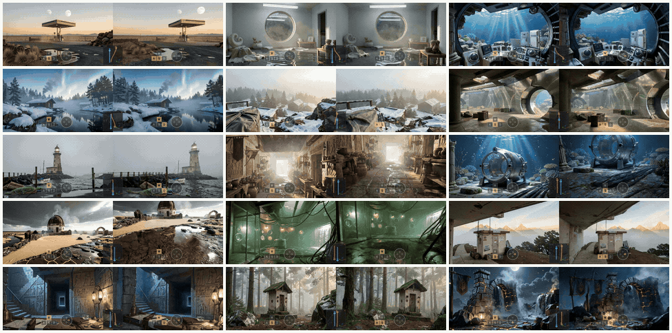
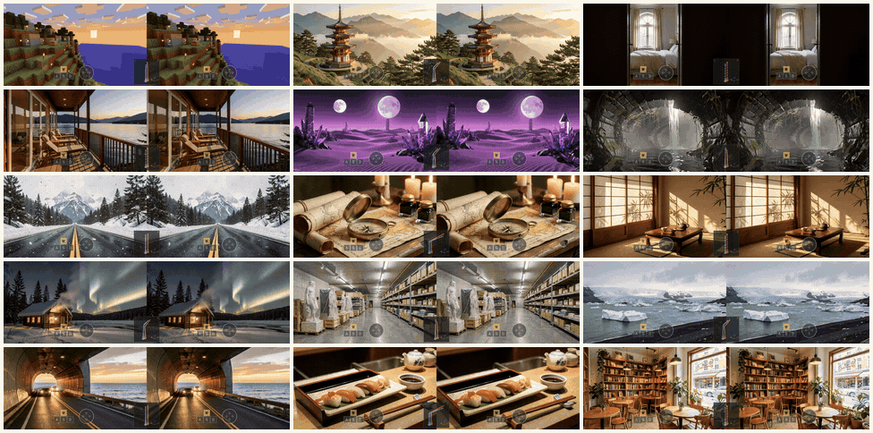
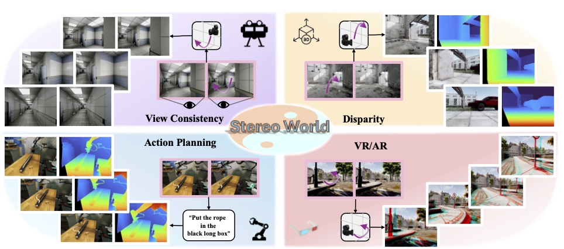

# Stereo World Model

[](https://arxiv.org/abs/2603.17375)
[](https://sunyangtian.github.io/StereoWorld-web/)
[](https://huggingface.co/Yang-Tian/StereoWorld)


## Demo Gallery

### Flexible Stereo



### Fixed-Baseline Stereo



## Features

- Camera-guided stereo video generation from a single RGB image.
- WASD-style camera controls for translation, yaw, and pitch.
- **Flexible stereo**: independent left/right camera control with multiple right-camera modes (converging, horizontal offset, depth offset, height offset).
- **Fixed-baseline stereo**: side-by-side stereo output with configurable stereo baseline.
- **Autoregressive long video**: 4-step autoregressive student model for generating extended sequences beyond the single-clip frame budget.
- Single-GPU inference and optional multi-GPU sequence-parallel inference.



## Installation

Create a Python environment and install the dependencies:

```bash
python3 -m venv .venv
source .venv/bin/activate
pip install --upgrade pip
pip install -r requirements.txt
```

The code is tested with CUDA 12.6 and PyTorch 2.4+. For faster attention, install `flash-attn` if it is compatible with your CUDA/PyTorch environment. Multi-GPU sequence parallel inference additionally requires `xfuser` and its dependencies.

## Model Weights

The teacher models are hosted in [Yang-Tian/StereoWorld](https://huggingface.co/Yang-Tian/StereoWorld).

Download all released models:

```bash
huggingface-cli download Yang-Tian/StereoWorld --local-dir weights
```

Or download only the one you need:

```bash
# Fixed-Baseline Stereo
huggingface-cli download Yang-Tian/StereoWorld \
  --include "StereoWorldModel/*" \
  --local-dir weights

# Flexible Stereo
huggingface-cli download Yang-Tian/StereoWorld \
  --include "StereoWorldFlexModel/*" \
  --local-dir weights

# Fixed-Left View Inpainting
huggingface-cli download Yang-Tian/StereoWorld \
  --include "StereoWorldInpaintModel/*" \
  --local-dir weights
```

Download the 4-step autoregressive student from [ToRealU/StereoWorld-AR-4Step](https://huggingface.co/ToRealU/StereoWorld-AR-4Step):

```bash
huggingface-cli download ToRealU/StereoWorld-AR-4Step \
  stereoworld_ar_4step.pt \
  --local-dir weights
```

You can keep the weights anywhere and pass their paths with `--pipeline_dir` and `--checkpoint`.

## TODO

- [x] Open-source the 5-second, 832x480 binocular teacher model.
- [x] Release the 4-step autoregressive student model.
- [x] Release more flexible multi-view world model.

## Quick Start

### Fixed-Baseline Stereo

Run the included demo set on one GPU:

```bash
bash run_single.sh \
  --pipeline_dir weights/StereoWorldModel \
  --use_raymap
```

Run on multiple GPUs:

```bash
bash run.sh \
  --pipeline_dir weights/StereoWorldModel \
  --num_gpus 4 \
  --use_raymap
```

By default, the scripts use `ExpData/demo_custom_eval.json`, which contains 33 prompt/action examples. The corresponding input images are included under `ExpData/demo_custom/`.

### Autoregressive Long Video

Run the 4-step autoregressive student on one GPU:

```bash
bash run_ar.sh \
  --pipeline_dir weights/StereoWorldModel \
  --checkpoint weights/stereoworld_ar_4step.pt \
  --eval_json ExpData/demo_custom_eval.json \
  --output_dir output_ar \
  --num_frames 153
```

### Flexible Stereo

Run the flexible stereo model on one GPU:

```bash
bash run_flex_single.sh \
  --pipeline_dir weights/StereoWorldFlexModel
```

Run on multiple GPUs:

```bash
bash run_flex.sh \
  --pipeline_dir weights/StereoWorldFlexModel \
  --num_gpus 4
```

By default, the scripts use `ExpData/flex_demo_custom_eval.json`, which contains 77 prompt/action examples across four right-camera modes. The corresponding input images are included under `ExpData/flex_demo_custom/`.

### Fixed-left View Inpainting

The curated video inputs are bundled as `ExpData/view_inpaint/case1.mp4`
through `case5.mp4`. Their camera settings are collected in
`ExpData/view_inpaint_eval.json`. Download the inpainting model first:

```bash
huggingface-cli download Yang-Tian/StereoWorld \
  --include "StereoWorldInpaintModel/*" \
  --local-dir weights
```

Then run the batch demo on one GPU:

```bash
bash run_view_inpaint_single.sh
```

The default pipeline directory is `weights/StereoWorldInpaintModel`. Pass
`--pipeline_dir /path/to/StereoWorldInpaintModel` to use another location.

<details>
<summary><b>Custom Inference</b> — batch/single-folder inference options (click to expand)</summary>

### Fixed-Baseline Stereo

Batch inference from an eval JSON:

```bash
python3 inference.py \
  --pipeline_dir weights/StereoWorldModel \
  --eval_json /path/to/eval.json \
  --output_dir output \
  --H 480 --W 832 \
  --num_frames 81 \
  --baseline 0.2
```

Single-folder inference:

```bash
python3 inference.py \
  --pipeline_dir weights/StereoWorldModel \
  --input_dir /path/to/sample_folder \
  --action_seq w wl wj \
```

For `--input_dir`, the folder should contain:

```text
sample_folder/
  left.png
  caption.txt
```

For `--eval_json`, each entry should contain:

```json
{
  "image_path": "./demo_custom/example.jpg",
  "caption": "A descriptive text prompt.",
  "action_seq": ["w", "wl", "wj"],
  "scene_name": "example_scene"
}
```

Relative `image_path` values are resolved relative to the JSON file. `scene_name` is optional; when omitted, the image filename is used.

### Flexible Stereo

Batch inference from an eval JSON:

```bash
python3 inference_flex.py \
  --pipeline_dir weights/StereoWorldFlexModel \
  --eval_json /path/to/eval.json \
  --output_dir output_flex \
  --H 480 --W 832 \
  --num_frames 81
```

For `--eval_json`, each entry should contain:

```json
{
  "image_path": "./flex_demo_custom/scene_example.jpg",
  "caption": "A descriptive text prompt.",
  "right_mode": "converging",
  "action_seq_left": ["w", "wl"],
  "action_speed_left": [3, 2],
  "action_seq_right": ["w", "wl"],
  "action_speed_right": [3, 2],
  "scene_name": "example_scene"
}
```

Supported `right_mode` values:

| Mode | Description |
| --- | --- |
| `converging` | Left and right cameras converge toward a common point |
| `horizontal_offset` | Right camera offset horizontally from left |
| `depth_offset` | Right camera offset along the depth axis |
| `height_offset` | Right camera offset vertically from left |

Left and right cameras have independent action sequences and speed lists, enabling asymmetric camera trajectories.

</details>

## Camera Actions

| Key | Motion |
| --- | --- |
| `w` | move forward |
| `s` | move backward |
| `a` | move left |
| `d` | move right |
| `j` | yaw left |
| `l` | yaw right |
| `i` | pitch up |
| `k` | pitch down |

Actions can be combined in one segment, for example `wl` means moving forward while yawing right.

## Outputs

Each job writes:

- `{scene_name}.mp4`: side-by-side stereo video, left view on the left and right view on the right.
- `{scene_name}.json`: metadata including caption, action sequence, baseline, intrinsics, and camera poses.

`num_frames` must satisfy `1 + 4k`, for example `81` or `121`. Height and width must be divisible by 8.

## Acknowledgements

We thank the authors of the following projects and models for their open-source contributions:

- [prope](https://github.com/liruilong940607/prope)
- [DreamX-World](https://github.com/AMAP-ML/DreamX-World)
- [StereoCrafter](https://github.com/TencentARC/StereoCrafter)
- [Wan-AI](https://huggingface.co/Wan-AI)

## Citation

If you find our work useful, please consider citing:

```bibtex
@article{sun2026stereo,
  title={Stereo World Model: Camera-Guided Stereo Video Generation},
  author={Sun Yang-Tian and Huang Zehuan and Niu Yifan and Ma Lin and Cao Yan-Pei and Ma Yuewen and Qi Xiaojuan},
  journal={arXiv preprint arXiv:2603.17375},
  year={2026}
}
```
